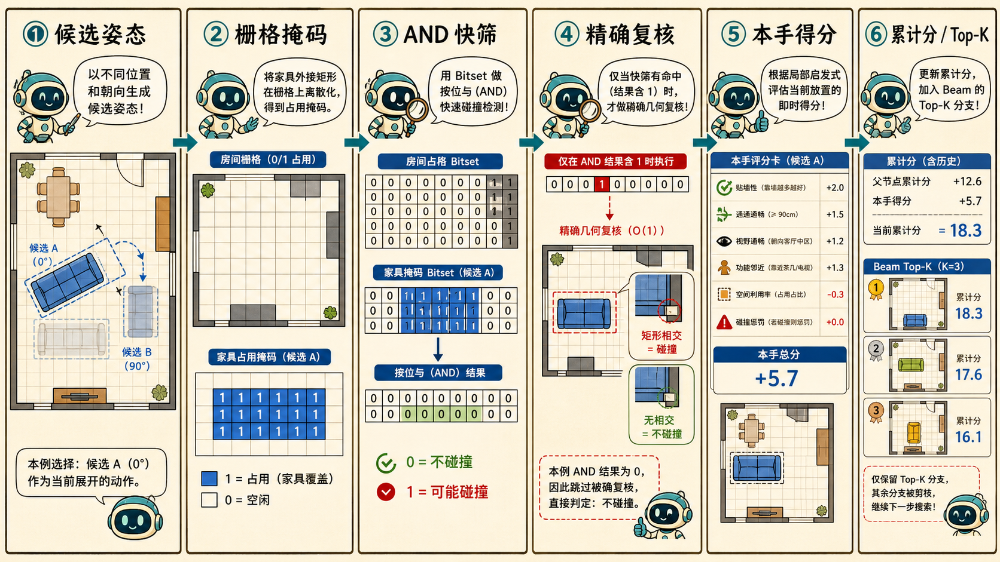
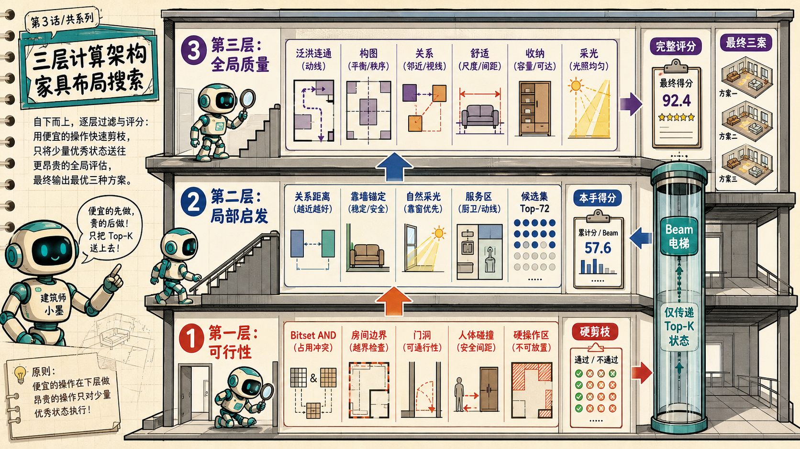
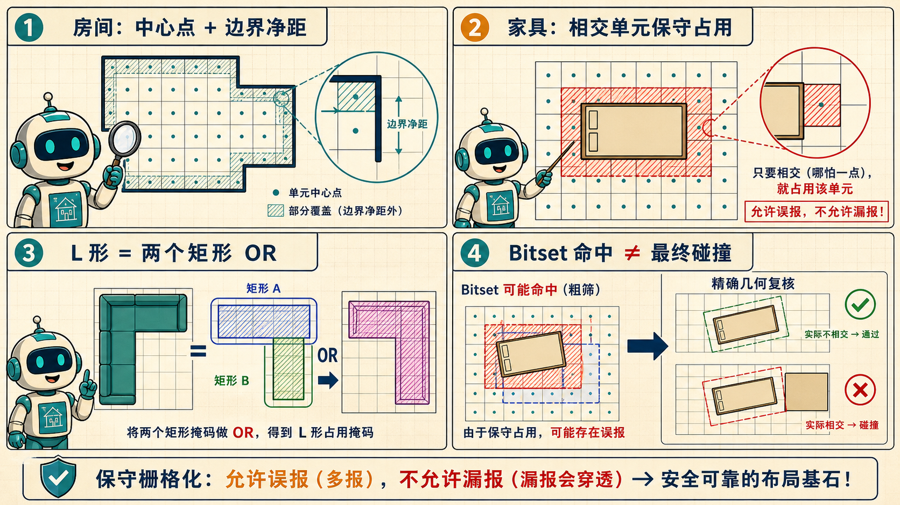
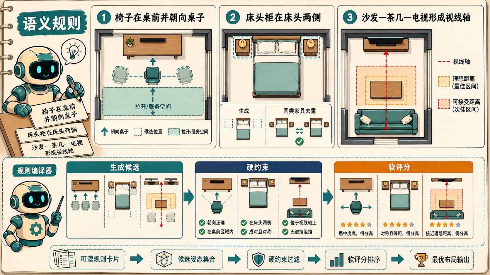

# 空间棋 AI：Bitset、家具约束与三层计算 QA

> 本文严格对应当前 [`bedroom-space-chess-V3.html`](bedroom-space-chess-V3.html) 的实现，而不是一份脱离代码的理论设想。
>
> 一句话结论：当前引擎是“语义候选生成 + Bitset 保守快筛 + 矩形几何复核 + Beam 多步搜索 + 最终全局评分”，不是把家具在整间房的每个格子上暴力滑动。

---

## 总览：一次“落子”到底经过什么

```text
家具数量与尺寸配置
        ↓
按家具语义生成少量候选姿态
        ↓
静态硬规则（房间内、门、窗、靠墙、操作区）
        ↓
Bitset 身体碰撞 / 功能区冲突快筛
        ↓ 命中时才执行
矩形浮点几何精确复核
        ↓
计算“本手局部启发分”
        ↓
每个父局面只留本手前 72 个候选
        ↓
同类家具去重 → 前向检查 → 部分回合通行水漫 → Beam Top-K
        ↓ 全部家具完成
最终通行、关系、构图、舒适、收纳、采光完整评分
        ↓
近重复聚类，输出综合 / 通行 / 构图三类方案
```

---

## Q1：Bitset 家具 Box 是怎样摆进去的？每一步的得分怎么算？



### A1.1：家具是不是先变成一个 Box？

大部分家具是一个轴对齐矩形 Box：

```text
pose = (中心 x, 中心 y, rotation, normal, wallDir, relation ...)
box  = (中心 x, 中心 y, 宽 w, 深 d)
```

当前旋转只使用 `0° / 90°`，所以旋转后只需要交换宽和深：

```text
rotation = 0°   → (w, d)
rotation = 90°  → (d, w)
```

L 形沙发不是用一个大包围盒直接判碰撞，而是由 `footprintRects()` 拆成两个矩形：

```text
L 形实体 = 主座矩形 ∪ 贵妃位延伸矩形
L 形掩码 = 主座 mask OR 贵妃位 mask
```

因此 L 形凹进去的空白部分不会被当作家具实体占满。这正是 Bitset 支持异形家具的基本方法：把一个异形轮廓分解成少量矩形或凸形，再把各部分的占用掩码做 OR。

### A1.2：候选位置从哪里来？会不会扫完整个剩余空间？

不会遍历房间内的每个格子。`rawCandidatesForItem()` 会根据家具类型选择候选生成器：

| 来源 | 当前例子 | 候选数量为什么少 |
|---|---|---|
| 沿墙采样 | 床、衣柜、书桌、柜体 | 只沿水平/垂直墙，在端点、中点、1/3、1/4及约 0.36 m 分槽处采样 |
| 家具关系采样 | 床头柜、工作椅、茶几、餐椅 | 从父家具坐标直接推导几个相对位置 |
| 功能区采样 | 浮动沙发、餐桌 | 只尝试预设归一化区域和设计语法锚点 |
| 角落采样 | 绿植、休闲椅、洗衣篮 | 通常只尝试四个角落 |
| 参数化墙段 | 衣柜、餐边柜等 | 先计算墙上剩余区间，再尝试若干宽度及左/中/右位置 |

例如床头柜不是在全房间扫描，而是根据床头墙方向直接生成左右两个位置：

```text
侧向偏移 = 床宽 / 2 + 床头柜宽 / 2 + edgeGap
候选侧别 = -1（左）或 +1（右）
```

工作椅只生成书桌正前方横向 `-0.25 m、0、+0.25 m` 三个候选；茶几只生成沙发前方三个横向偏移候选。

所以“试摆快”的第一原因不是 Bitset，而是候选域先被语义规则从成千上万个网格位置缩成了个位数或几十个有意义的位置。

### A1.3：家具怎样变成 Bitset？

矩阵搜索使用约 `0.12 m` 的栅格步长：

```text
cols  = ceil(roomWidth  / 0.12)
rows  = ceil(roomDepth  / 0.12)
cell  = y × cols + x
word  = cell >> 5             // 除以 32
bit   = 1 << (cell & 31)      // 对 32 取余
```

一个 32 位整数保存 32 个栅格。家具覆盖某个格子，就把相应 bit 设为 1。

每个候选姿态会缓存三份稀疏掩码：

| 掩码 | 内容 | 用途 |
|---|---|---|
| `bodyMask` | 家具实际身体 | 写入当前局面的占用集合 |
| `collisionMask` | 家具身体向外膨胀约 `0.026 m` | 做一般家具安全间距快筛 |
| `actionMask` | 硬功能区，如柜门开启区 | 防止后续家具侵占操作空间 |

局面本身保存：

```text
_occ      = 所有已放家具 bodyMask 的 OR
_hardOcc  = 所有硬功能区 actionMask 的 OR
```

试摆候选 C 时，核心判断是：

```text
身体可能碰撞 = (_occ AND C.collisionMask) != 0

功能区可能冲突 =
    (_hardOcc AND C.bodyMask) != 0
 OR (_occ     AND C.actionMask) != 0
```

这里每次只需循环候选掩码中非零的 32 位 word，而不是逐个家具做全量几何运算。

### A1.4：Bitset 命中就一定淘汰吗？

不是。Bitset 是保守 broad phase：

- AND 为 0：确定没有栅格重叠，直接通过碰撞阶段。
- AND 非 0：只代表“可能碰撞”，再执行 `exactProfileCollision()` 或 `exactProfileFunctionalConflict()`。
- 精确复核不相交：仍然通过；这是允许的栅格假阳性。
- 精确复核相交：才真正淘汰。

当前的“精确复核”是对家具拆分后的浮点矩形做重叠判断：

```text
|ax - bx| < (aw + bw) / 2 + clearance
且
|ay - by| < (ad + bd) / 2 + clearance
```

它对当前 `0° / 90°` 矩形及矩形分解的 L 形是精确的；它还不是支持任意旋转、多边形曲线的通用 CAD 布尔运算。

### A1.5：每放一个家具，是否都算一次得分？

是，但要区分两种分数。

#### 1. 每一手都会算：局部启发分 `merit`

候选通过硬规则后，`candidateStaticScore()` 立即计算这一手的局部分。它主要回答：

> “只看当前这件家具及已经落下的家具，这个位置是否像一个好位置？”

当前局部分包含：

- 候选来源基础分：靠墙通常从 8 分开始，关系/区域候选通常从 15 分开始。
- 家具类型偏好：床远离入口、书桌接近窗、柜体不挡窗。
- 语义关系奖励：床头柜在床侧 `+52`，工作椅在桌前 `+48`，茶几在沙发前 `+54`。
- 距离带奖励：例如电视与沙发距离靠近目标值时加分。
- 操作区完整度：服务区 9 个采样点落在房间内的比例，最多约 `+10`。
- 服务区与既有家具重叠惩罚：通常 `-13`。
- 入口主通道附近的占用惩罚：`-18`。
- 参数化柜体宽度、墙段填充率奖励。

#### 2. 当前节点的累计分

```text
节点累计分 = 父节点累计分 + 本手 merit + 前向余量奖励
```

前向余量奖励来自“下一件家具还有多少合法位置”：

```text
forwardBonus = min(下一手合法候选数, 12) × 0.28
```

因此树节点里看到的“本手分”与“累计分”不是同一概念。

#### 3. 不会每一手都完整重算：全局最终分

通行水漫、整套关系、构图平衡、收纳连续度等完整指标较贵，不会对所有中间候选都计算。当前只在以下位置调用：

- 核心家具或长柜落下后，用最窄人体尺度做一次早期通路硬检查。
- 全部家具放完后，对最多前 72 个 Beam 状态做完整评估。

所以速度来自：每一步只算便宜局部分，昂贵全局分只算少量幸存完整方案。

### A1.6：一轮到底保留多少？

当前矩阵搜索的关键上限：

1. 每个父局面针对当前家具，局部分排序后最多保留 72 个候选。
2. 所有父局面的候选合并并去重。
3. 昂贵检查前预截断到 `max(Beam + 32, Beam × 2)`。
4. 最后只留下 `BeamWidth` 个状态进入下一手；默认搜索通常使用自适应 Beam，核心函数默认值为 120。
5. 最终最多取前 72 个完整状态做全局评分。

---

## Q2：家具的不同约束配置在哪一步起作用？具体如何起作用？


### A2.1：当前配置并不是一张表在同一时刻统一执行

它们分散在五个阶段，每类配置的职责不同：

| 配置类别 | 当前载体 | 生效阶段 | 结果 |
|---|---|---|---|
| 数量上下限 | `PROGRAMS.types.minCount/maxCount`、`CONFIGS.counts` | 搜索前 `buildFurniture()` | 决定本局实际有几颗棋子及落子顺序 |
| 家具尺寸/形状 | `CONFIGS.dimensions`、`SOFA_PRESETS` | 搜索前 + 掩码编译 | 决定 Box/L 形实体和所有候选的占用 |
| 锚定方式 | `requiredAnchor:'wall'` | 候选生成 + 静态硬校验 | 非靠墙姿态直接淘汰 |
| 避窗 | `avoidWindow:true` | 墙段候选生成 + 静态硬校验 | 生成时扣掉窗段，复核时再次拦截 |
| 服务/操作区 | `service:{side,depth,spanExtra,hard}` | 掩码编译 + 硬冲突或最终舒适评分 | `hard:true` 会剪枝；`hard:false` 主要影响评分 |
| 特许占用 | `allowBodyTypes`、`RELATION_PAIR_RULES` | 功能区精确复核 | 允许配套椅子进入桌前操作区等 |
| 家具相对关系 | `relation`、相对候选生成器 | 候选生成 + 局部分 + 最终关系分 | 让高质量候选先出现并获得奖励 |
| 设计语法 | `DESIGN_GRAMMAR` | 区域候选 + 全局构图 | 把功能组投影到宽/深房间的归一化区域 |
| 功能组合包 | `FUNCTION_BUNDLES` | 外层自动选配家具 | 决定哪些 0–N 家具组合值得进入一次完整搜索 |

### A2.2：硬规则与软规则的区别是什么？

硬规则返回布尔值：不满足就不能进入 Beam。

当前硬规则包括：

- 家具实体必须在房间轮廓内。
- 家具不能占据开门禁区。
- `requiredAnchor:'wall'` 的家具必须来自墙锚候选。
- `avoidWindow:true` 的家具不能覆盖窗口段。
- 家具身体之间不能超过配对规则允许值发生碰撞。
- 柜门开启区、椅子后退区等 `hard:true` 功能区不能被不允许的家具侵占。
- 关键目标必须从门口可达；部分回合和最终阶段都会检查。

软规则返回连续分数：不好只会降分，不一定立即淘汰。

当前软规则包括：

- 书桌离窗越近越好。
- 茶几和沙发的净距进入理想区间更好。
- 电视和沙发正对、居中、距离合适更好。
- 床头柜成对且对称更好。
- 功能组紧凑但不过密更好。
- 家具质量中心靠近房间中心更平衡。
- 沿墙柜体连续、少留窄缝更好。

### A2.3：操作区究竟怎样生成？

`zoneRectFromSpec()` 根据家具朝向生成一个附属矩形。以家具正前方操作区为例：

```text
操作区中心 = 家具中心
           + 正面法向 × (家具深度/2 + gap + 操作区深度/2)

操作区宽度 = 家具宽度 + 2 × spanExtra
操作区深度 = service.depth
```

如果 `side:'back'`，方向反转；如果是 `left/right`，改用家具侧向轴。

例如：

- 衣柜：前方 `0.74 m` 柜门开启区，硬约束。
- 书桌：前方 `0.72 m` 座椅与工作区，硬约束，但允许 `chair` 进入。
- 工作椅：后方 `0.48 m` 后退区，硬约束。
- 沙发：前方 `0.78 m` 起坐区，当前是软约束。
- 床：床尾 `0.72 m` 活动区，当前是软约束。

### A2.4：允许重叠是不是意味着可以碰撞？

不是。要区分“身体碰撞”和“身体进入功能区”：

- `allowBodyTypes:['chair']` 只允许椅子身体进入书桌的工作区。
- 椅子实体仍不能穿进书桌实体。
- `RELATION_PAIR_RULES['bed-side']` 允许床头柜与床的功能区按语义重叠，并把床—床头柜实体净距设为 0，以允许贴合。
- 其他普通家具对默认仍有约 `0.025 m` 的浮点碰撞净距。

### A2.5：0–N 家具的配置在哪一步生效？

在搜索开始前，`buildFurniture()` 把“类型和数量”展开为本轮明确的棋子序列。例如床头柜数量为 2 时，内部会得到两个实例；搜索树显示为“床头柜 1/2、2/2”。

当前系统的 0–N 灵活性主要在外层库存选择：

1. 主家具由 `minCount:1` 保证存在。
2. 附属家具通常为 `minCount:0`、`maxCount:N`。
3. 自动库存前沿生成多个不同数量组合。
4. 每个组合分别运行一次完整 Beam 搜索。
5. 不同库存组合再比较功能价值、密度与布局质量。

这意味着“0 件床头柜”当前不是在同一棵家具落子树里创建一个 Skip 子节点，而是在外层选择了一个不含床头柜的库存组合。两种架构都合理；当前方案能避免在每个家具回合额外把 Beam 分支翻倍。

---

## Q3：如果分成三层计算，每一层具体如何计算？



### A3.1：第一层——可行性层（便宜、保守、负责硬剪枝）

输入：

```text
父局面 S + 当前家具 F + 一个候选姿态 P
```

计算顺序：

1. 用缓存的 `matrixProfile(F,P)` 取得实体矩形、硬功能区和三份 Bitset。
2. 检查家具轮廓是否在房间内。
3. 检查是否挡门、违背靠墙、避窗和硬操作区边界。
4. `occupancy & collisionMask` 做身体碰撞 broad phase。
5. Bitset 命中时才做矩形浮点精确复核。
6. 用 `_hardOcc & bodyMask`、`_occ & actionMask` 快筛功能冲突。
7. 命中时才按 `allowBodyTypes` 和配对规则做精确复核。

输出只有两类：

```text
非法 → 记录越界 / 门窗 / 碰撞 / 功能冲突原因并剪掉
合法 → 进入第二层计算局部分
```

这一层的设计原则是：宁可让 Bitset 多报一次“可能碰撞”，再复核；不能因为栅格近似漏掉真实碰撞。

### A3.2：第二层——局部启发与搜索层（每一手执行）

对第一层通过的每个候选计算 `merit`：

```text
merit = 类型基础偏好
      + 关系奖励
      + 距离 / 朝向 / 采光奖励
      + 服务区完整度
      - 挡入口 / 服务区重叠等惩罚
```

然后依次执行：

1. 每个父节点内部按 `merit` 排序，只留前 72 个。
2. 形成新完整状态，累计 `partialScore + merit`。
3. 用 canonical `stateHash()` 合并同类家具交换顺序造成的同构局面。
4. 只让累计分前 `max(Beam+32, 2×Beam)` 名进入较贵检查。
5. 为下一件家具做一次不计分的候选矩阵，若合法域为 0，则前向剪枝。
6. 按下一手合法域大小给予最多 `12 × 0.28 = 3.36` 的余量奖励。
7. 在茶几、餐桌、衣柜、书桌落下后，用 `0.23 m` 半径做早期水漫；关键目标不可达则剪枝。
8. 全部候选按累计分排序，只保留 Beam Top-K。

这一层使用的是搜索代理分，不等于最终方案总分。它的职责是高召回地保住有希望的分支，而不是精确判断最终冠军。

### A3.3：第三层——完整全局质量层（只评估少量完整状态）

全部家具完成后，最多取前 72 个状态运行 `evaluateFull()`。

#### 通行计算

使用另一套约 `0.14 m` 栅格，并分别模拟三种人体半径：

| 等级 | 半径 |
|---|---:|
| tight | 0.23 m |
| normal | 0.31 m |
| comfortable | 0.40 m |

房间先按人体半径向内收缩；家具按人体半径向外膨胀。从门口最近自由格开始用 Bitset 水漫，计算：

- 多少目标家具的服务入口可达。
- 主要目标是否全部可达。
- 自由空间中有多少比例连成门口主连通域。
- 三种人体尺度下的通过程度。

`tight` 级主要目标全部可达，才满足 `hardPass`。

#### 完整评分维度

当前总分权重：

```text
总分 = 功能 × 15%
     + 通行 × 20%
     + 关系 × 20%
     + 构图 × 20%
     + 收纳 × 10%
     + 舒适 × 10%
     + 采光 × 5%
```

其中“硬规则”显示为一个独立诊断分，不直接乘入加权总分；它通过 `hardPass` 和质量门槛控制能否入选。

完整方案还会被短板封顶：即使其他项很高，功能、通行、关系、构图或舒适太低，总分也不能靠平均数掩盖短板。

严格质量门槛为：

```text
全部家具已放置
且 tight 人体尺度下主要目标全部可达
且 通行 ≥ 55
且 关系 ≥ 62
且 构图 ≥ 55
且 舒适 ≥ 52
```

严格方案不足 3 个时，会使用稍宽松但仍满足硬通行的候选池。

#### 最终三案如何选

1. 先按完整家具位置做近重复聚类，距离阈值为 `0.36`。
2. 同类型家具用最小代价匹配，因此床头柜 A/B 交换不被视为新方案。
3. 方案 A：完整总分最高。
4. 方案 B：偏重通行与舒适。
5. 方案 C：偏重构图、关系与收纳。
6. 三案之间还要求一定布局差异，避免只输出肉眼几乎相同的结果。

---

## Q4：房间或家具只占了一部分栅格，细节怎样处理？



### A4.1：首先要分清两套栅格

| 栅格 | 步长 | 目的 | 房间边界处理 |
|---|---:|---|---|
| 碰撞矩阵栅格 | 约 0.12 m | 批量试摆、身体与操作区 broad phase | 候选先用浮点轮廓校验；栅格只存家具占用 |
| 通行水漫栅格 | 约 0.14 m | 模拟不同人体半径下的自由空间连通 | 用格子中心是否在房间内，并检查到边界的净距 |

不能把可视化里画出来的一张网格理解为全系统只有一份相同栅格。

### A4.2：家具只覆盖一个格子的一小部分，算占用吗？

当前 `rasterRectMask()` 使用矩形外接范围的 floor 索引，把从最小边界到最大边界所跨过的格子全部置 1。

因此只要家具矩形触及某个格子范围，该格子通常就会保守占用。这会带来：

- 可能多报碰撞，也就是假阳性。
- 不容易漏掉真实碰撞，也就是尽量避免假阴性。
- Bitset 命中后再用浮点矩形消除假阳性。

这正是 broad phase 应有的取舍。

### A4.3：异形房间边缘没占满一个格子，算房间内部吗？

碰撞矩阵阶段不直接依赖“房间占用 Bitset”判定家具是否在房间内，而是先执行 `rectInsidePolygon()`：对每个矩形取 3×3 共 9 个浮点采样点，全部在房间多边形内才视为通过。

通行阶段则对每个格子的中心点进行判断：

1. 中心点必须在房间多边形内。
2. 中心点到最近房间边界的距离，加上约 `step × 0.42` 的格子补偿后，仍需大于当前人体半径。
3. 不满足的边缘格不进入可行走 room mask。

这相当于先把房间按人体半径“向内腐蚀”，避免水漫路径贴着墙缝穿过去。

### A4.4：家具膨胀后的边缘格如何处理？

通行阶段把家具矩形按人体半径向外膨胀再栅格化：

```text
普通固定家具 padding = 人体半径
椅子、梳妆凳、餐椅、脚凳 padding = 人体半径 × 0.22
```

后者被当作可轻微移动的家具，所以通行障碍膨胀更小。这是一种工程近似，而不是人体真实运动学模型。

### A4.5：当前栅格与几何处理有什么已知边界？

必须坦白说明四点：

1. 家具当前仅支持 0°/90°；斜放家具尚未进入通用旋转矩形 SAT 检测。
2. L 形由两个矩形表示，适合当前演示，但任意曲线或复杂多边形需要更通用的轮廓分解。
3. 房间内含判断使用 9 点采样，并非真正的矩形—多边形裁剪；对当前简单正交、L 形、切角户型够用，但对复杂凹多边形理论上仍可能出现边穿越却采样点都在内的极端情况。
4. 0.12/0.14 m 是速度与精度折中。若输入精细到厘米级，应该自适应减小步长，或使用多分辨率栅格。

若将来接入真实 CAD 户型，建议升级为：

```text
Bitset / 距离场 broad phase
        ↓
OBB / SAT / 多边形裁剪 narrow phase
        ↓
局部高分辨率栅格或导航网格做通行复核
```

---

## Q5：家具配置能否写成“椅子在桌子正对面”“床头柜在床头两侧”这样的语义规则？



### A5.1：可以，而且当前 HTML 已经做了一半

当前实现已经有语义字段和专用生成器：

- `relation:'desk-front'`：椅子在书桌前。
- `relation:'bed-side'`：床头柜在床头左右。
- `relation:'sofa-front'`：茶几在沙发前。
- `relation:'sofa-facing'`：电视与沙发对向。
- `relation:'dining-seat'`：餐椅在餐桌四周并朝向餐桌。
- `relation:'bed-foot'`：床尾凳位于床尾。
- `relation:'seat-light'`：落地灯靠近座位。

这些关系同时参与三个环节：

1. 生成器直接产生相对候选坐标。
2. 硬约束决定是否必须满足、允许哪些服务区重叠。
3. 软评分决定满足得多好。

### A5.2：“椅子肯定放在桌子正对着的地方”应怎样表达？

建议不要把“正对”写成一个单一布尔值，而是拆成可解释参数：

```yaml
rule: chair_faces_desk
subject: chair
target: desk
candidate:
  region: target.front
  lateral_offsets: [-0.25, 0, 0.25]
  clear_gap: 0.32
  facing: toward_target
hard:
  require_target: true
  body_collision: forbidden
  allow_enter_target_zone: true
soft:
  centered_weight: 0.45
  facing_weight: 0.55
```

编译后：

- `candidate` 生成桌前 3 个候选，而不是扫全房间。
- `hard` 确保椅子不能穿过桌子，允许它进入桌前工作区。
- `soft` 用横向偏移和朝向点积给连续分，居中且面对桌子的候选更高。

### A5.3：“床头柜通常放在床头两边”应怎样表达？

```yaml
rule: bedside_pair
subject: nightstand
target: bed
count: 0..2
candidate:
  slots: [head_left, head_right]
  edge_gap: 0.00
hard:
  same_head_wall: true
  body_collision: forbidden
  functional_overlap: allowed
soft:
  pair_bonus: 1.0
  symmetry_weight: 1.0
identity:
  interchangeable: true
```

这里最重要的是把“数量”“位置槽”“几何合法性”“对称评分”“实例身份”分开：

- 数量为 0：这个库存组合不创建床头柜棋子。
- 数量为 1：左右槽都可尝试，择优保留。
- 数量为 2：两个实例占据两个不同槽位。
- A/B 只是搜索实例，不是设计语义；状态哈希按同类型位置集合排序，交换顺序自动合并。

### A5.4：语义规则应该全部设成硬约束吗？

不应该。建议分成四级：

| 级别 | 含义 | 例子 | 搜索行为 |
|---|---|---|---|
| 必须 | 违反即不可用 | 柜体不能挡门；床必须在房间内 | 立即剪枝 |
| 条件必须 | 目标存在时必须 | 有书桌时，工作椅必须服务书桌 | 条件成立才剪枝 |
| 偏好 | 通常如此，但允许例外 | 床头柜尽量成对对称 | 降分，不直接剪 |
| 目标 | 用于方案差异化 | 通行优先、功能丰富 | 最终重排与选方案 |

“语义化”不等于“全部绝对化”。如果把所有室内常识都写成硬规则，小户型会很容易无解。

### A5.5：当前代码距离真正的语义规则系统还差什么？

当前关系大多散落在：

- `rawCandidatesForItem()` 的家具类型分支。
- `relative...Candidates()` 专用函数。
- `candidateStaticScore()` 的 if 判断。
- `relationSatisfied()` 的 if 判断。
- `FURNITURE_RULES` 与 `RELATION_PAIR_RULES`。

它已经能工作，但新增规则时需要同时改多个地方，容易漏改。下一步最值得做的是建立统一的“规则编译器”：

```text
可读语义规则卡
    ├─ 编译为 CandidateGenerator
    ├─ 编译为 HardPredicate
    ├─ 编译为 SoftScoreTerm
    ├─ 编译为 FunctionalZone
    └─ 编译为 Explanation
```

同一条规则同时负责计算和解释，搜索树节点就可以显示：

```text
通过：椅子位于书桌前方 0.32 m，朝向得分 0.96
淘汰：候选不在床头左右槽
降分：第二只床头柜缺失，对称项 -12
```

这样规则编辑器里看到的语义，就能与候选点、剪枝原因和最终分数一一对应。

### A5.6：当前实现中，“椅子肯定在桌前”是否百分之百成立？

在正常的卧室落子顺序中基本成立：书桌先落，椅子随后只生成 `desk-front` 候选。

但从代码健壮性看，目前 `rawCandidatesForItem()` 在专用生成器返回空时会回退到通用沿墙候选。因此若人为配置“有椅子、无书桌”，椅子可能退化成沿墙候选，而不是明确跳过或报依赖缺失。

更严格的语义系统应增加：

```yaml
requires_any: [desk]
on_missing_target: skip_item | reject_inventory | use_fallback
```

建议对配套椅子使用 `reject_inventory` 或 `skip_item`，不要静默退回无语义候选。

---

## 最后归纳：为什么当前试摆看起来如此快？

不是某一个技巧，而是六层减法叠加：

1. **不扫全房间**：语义生成器只产生少量有意义的候选。
2. **候选姿态缓存**：同一家具同一姿态的矩形与掩码复用。
3. **32 格并行判断**：Bitset 每次 AND 同时比较 32 个单元。
4. **先粗后精**：多数不相交候选无需逐家具几何复核。
5. **分层评分**：每手只算便宜局部分，昂贵全局分留给最后少数状态。
6. **持续剪枝**：每父节点 Top-72、同构去重、预截断、前向检查、早期水漫、Beam Top-K 共同控制树宽。

最准确的理解不是“家具 Box 被并行放进去了”，而是：

> 前端 JavaScript 把许多候选整理成扁平数组和 TypedArray，随后在一个紧凑循环中逐候选处理；每个候选内部用位运算一次比较 32 个格子。它目前不是 Web Worker/GPU 意义上的多线程并行，而是数据布局紧凑、计算非常便宜，因此表现得像批量并行。

---

## 当前代码中的关键函数索引

| 问题 | 函数 |
|---|---|
| Box/L 形实体 | `poseRect()`、`footprintRects()` |
| 候选生成 | `rawCandidatesForItem()`、`wallPoseCandidates()`、各 `relative...Candidates()` |
| 服务/操作区 | `zoneRectFromSpec()`、`functionalZones()` |
| 硬合法性 | `staticFurnitureRulesPass()`、`isLegal()` |
| 候选局部分 | `candidateStaticScore()` |
| Bitset 栅格 | `createMatrixContext()`、`rasterRectMask()`、`matrixProfile()` |
| 批量试摆 | `batchCandidateMatrix()` |
| 精确碰撞复核 | `exactProfileCollision()`、`exactProfileFunctionalConflict()` |
| 同构去重 | `stateHash()` |
| 通行栅格与水漫 | `createFlowContext()`、`floodBitset()`、`computeReachability()` |
| 最终完整评分 | `evaluateFull()`、`designMetrics()`、`livingMetrics()` |
| 最终近重复合并 | `stateDifference()`、`dedupeFinalLayouts()` |
| 三方案选择 | `chooseObjectiveSolutions()` |
