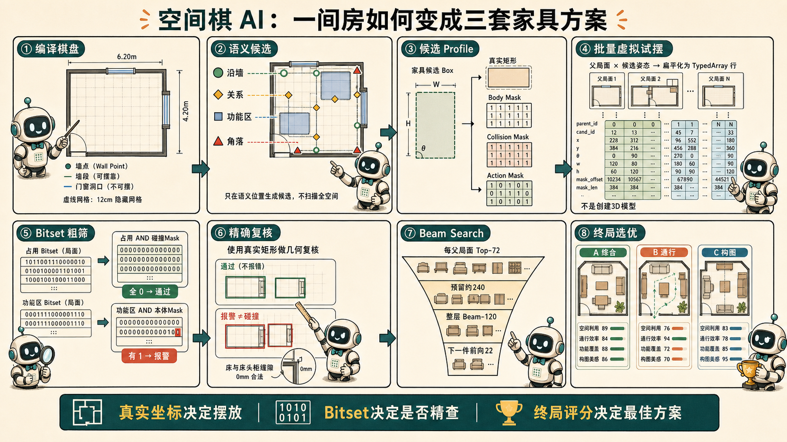

# 空间棋 AI：候选生成、快速试摆与终局选优 QA

> 对应当前 Prototype 09。本文集中回答候选如何产生、网格简化了什么、为什么试摆很快、实际试摆多少次，以及如何选出最佳方案。

## 一句话总原理

~~~text
语义公式生成少量真实位姿
→ 候选预编译为真实矩形和稀疏 Bitset
→ Bitset 批量粗筛
→ 只对报警候选做精确几何复核
→ 每层保留多条有潜力的棋谱
→ 全部家具摆完后用终局评分选优
~~~

---

## Q1：候选点是什么？

候选点不是一个孤立坐标，而是一件家具的一次完整候选位姿：

~~~text
(x, y, 旋转, 正面方向, 横向方向, 锚点, 关系, 可变尺寸)
~~~

家具坐标使用真实米制浮点值，不吸附到 12cm 网格。网格只用于后面的碰撞粗筛。

---

## Q2：候选点如何创建？

搜索每进入一层，只为“当前家具”生成候选；并且为每个当前保留的父局面分别生成。

候选主要有四类：

1. 沿墙候选：床、衣柜、电视柜等只取可放区间两端、中心、分数点和约每 0.36m 的补点。
2. 家具关系候选：用父家具真实位姿直接计算，例如床→床头柜、沙发→茶几、餐桌→餐椅。
3. 功能区候选：把少量 0–1 归一化点投影到当前房间。
4. 角落候选：从四角向室内偏移家具半径与维护距离。

通用关系公式：

~~~text
子家具中心
= 父家具中心
+ 父家具横向 × 横向偏移
+ 父家具正面 × 前后距离
~~~

床—床头柜使用关系专属零接缝：

~~~text
中心距离 = 床宽/2 + 床头柜宽/2 + 0mm
~~~

---

## Q3：候选点是一次生成当前家具在全部剩余空间里的点吗？

是“一次生成当前家具在当前所有父局面中的语义候选”，但不是扫描全部剩余空间。

例如当前保留 120 个沙发布局，每个沙发产生 3 个茶几位置：

~~~text
120 × 3 = 360 次茶几虚拟落子
~~~

如果每个父局面产生约 25 个沿墙电视候选：

~~~text
120 × 25 = 3000 次电视虚拟落子
~~~

下一件家具要等搜索进入下一层，或前向检查时才生成少量候选。

---

## Q4：候选生成为什么快？

因为没有二维穷举。候选主要是少量向量计算：

~~~text
墙点 = 墙起点 + 墙方向 × t
关系点 = 父家具 + 正面方向 × d + 横向方向 × offset
~~~

规模通常是：

~~~text
沿墙家具：墙数 × 每墙十几个结构点
关系家具：父家具数 × 2～6 个位置
功能区家具：约 9～18 个位置
角落家具：固定 4 个位置
~~~

第一加速来源是“少生成无意义候选”，Bitset 是第二层加速。

---

## Q5：一个 Box 如何被快速虚拟试摆？

普通家具只保存轴对齐矩形：

~~~text
(x, y, width, depth)
~~~

当前主要只允许 0°/90°，90°只交换宽深。L 形沙发也拆成两个矩形，所以不需要任意角 OBB、多边形求交或三角网格碰撞。

候选第一次出现时会编译并缓存 Profile：

~~~text
真实家具矩形
真实硬功能区矩形
静态合法性
Body Mask：家具本体
Collision Mask：家具本体＋默认净距
Action Mask：柜门、抽屉、椅子后退区
~~~

虚拟试摆不创建 DOM、Canvas、3D Mesh 或 CAD 实体，只处理位姿、缓存矩形和 Bitset。

---

## Q6：依附网格简化了哪些计算？

12cm 网格不决定家具位置，只替代大规模搜索中的广相计算。

| 原本可能需要的计算 | 当前简化 |
|---|---|
| 每候选遍历全部家具 | 父占用 AND 候选 Collision Mask |
| 每候选遍历全部功能区 | 硬功能占用 AND Body Mask；本体占用 AND Action Mask |
| 障碍物 Polygon Union | Bitset OR |
| 房间减全部家具 Polygon | roomMask AND NOT blockedMask |
| 连续 Polygon Offset / Minkowski Sum | 预生成膨胀 Mask |
| 任意角几何碰撞 | 0°/90°轴对齐矩形 |
| L 形 Polygon | 两个矩形 |
| 每节点重建整张棋盘 | 父 Bitset 复制＋候选 Mask OR |
| 每候选完整流线 | 关键层及终局才做 Bitset 水漫 |
| 每候选完整评分 | 中间只算便宜启发分 |

一个格子对应一位，32 个格子压入一个 Uint32。一次整数按位与可以同时检查 32 个空间状态。

候选 Mask 还是稀疏的，只保存实际影响的少数 word index 和 mask，无需扫描整张位图。

---

## Q7：Bitset 会损失毫米级精度吗？

不会直接损失摆放坐标精度，因为它只是 Broad Phase：

~~~text
Bitset 不相交
→ 安全跳过精确碰撞

Bitset 相交
→ 只表示“可能冲突”
→ 进入真实矩形与关系规则复核
~~~

位图允许误报，但不直接根据粗格淘汰贴合家具。例如床—床头柜零接缝时，粗 Mask 可能相交；精确检查使用 0mm 关系净距，确认只是边缘接触后放行。

~~~text
真实坐标决定摆放
Bitset 决定是否需要精确检查
~~~

---

## Q8：摆放判断是并行的吗？

当前不是真正多线程或 GPU 并行，而是：

~~~text
整层候选展平批处理
+ TypedArray 连续内存
+ 32 位整数位级并行
~~~

例如 120 个父局面、每个 30 个候选，会展平为 3600 条记录：

~~~text
parentIndex：来自哪个父局面
legalMask：是否合法
meritVector：便宜启发分
~~~

JavaScript 仍顺序循环，但每次 Bitset 运算同时检查 32 格，并避免绝大多数精确几何调用。Web Worker、WebAssembly SIMD 或 GPU Compute 才属于真正线程/硬件并行。

---

## Q9：真正“摆进去”为什么也快？

候选通过后不会立刻建立完整场景。系统先排序和去重，只有强分支才分配子局面。

~~~text
child._occ = parent._occ OR candidate.bodyMask
child._hardOcc = parent._hardOcc OR candidate.actionMask
~~~

约 6m × 5m 的房间使用 12cm 网格约有 2100 bit，即约 264 字节占用数据。复制父位图并 OR 少数有效字，成本很低。

搜索中的 Box 只是数据记录；搜索完成后，页面才把最终方案绘制到 Canvas。

---

## Q10：具体试摆多少个？

需要区分三种数量。

### 最终家具数

一套终局包含当前自动选配的 N 件家具。例如选配 18 件，则每套完整方案实际含 18 件。

### 每层虚拟试摆数

~~~text
父局面数 × 每个父局面的当前家具候选数
~~~

例如 120 × 30 = 3600 次。

### 搜索规模上限

~~~text
每个父局面最多保留 72 个当前家具候选
Beam 最多保留 120 个父局面
一层理论最大展开记录：120 × 72 = 8640
~~~

实际通常远低于此值。去重、硬规则和排序后，约 240 个强子局面优先分配占用数组，前向检查后最多 120 个进入下一层。

页面“节点数”是累计检查过的虚拟动作，不等于最终家具数。开启自动选配时，还可能累计多套家具清单的多次搜索。

---

## Q11：当前一步如何选位置？

当前一步不选唯一位置，而是两级保留。

### 每个父局面 Top-72

合法候选按便宜启发分排序，例如床远离入口、书桌靠窗、电视面对沙发、茶几位于沙发前方、长柜合理填墙。

### 整层 Beam-120

~~~text
partialScore = 父局面累计分 + 当前候选启发分
~~~

系统还为下一件家具最多生成 22 个候选做前向检查：

~~~text
下一件家具无处可放 → 当前分支立即剪掉
~~~

去重、排序和前向检查后，整层最多保留 120 条不同棋谱。因此局部第一名不会过早垄断全部搜索。

---

## Q12：最终最佳方案如何选出？

全部家具摆完后才做终局评分：

~~~text
功能 15%
通行 20%
家具关系 20%
构图 20%
墙面完成 10%
工学舒适 10%
采光 5%
~~~

还必须满足：

~~~text
全部家具已摆下
核心家具可达
通行 ≥ 55
关系 ≥ 62
构图 ≥ 55
舒适 ≥ 52
~~~

三套结果不是总分前三名：

~~~text
A 综合：终局总分最高
B 通行：通行、舒适优先
C 构图：构图、关系、墙面完成优先
~~~

系统同时要求方案之间有足够位置差异，避免输出三套几乎相同的布局。

---

## 最终核心总结

### 候选为什么快

~~~text
不扫描全空间
→ 用墙、家具关系、功能区和角落公式直接产生少量位置
~~~

### 试摆为什么快

~~~text
候选不是完整几何场景
→ 先用缓存稀疏 Bitset 做整数运算
→ 只有报警项才执行真实矩形复核
~~~

### 放进去为什么快

~~~text
不做 Polygon Union 或重建棋盘
→ 父占用 Bitset 复制
→ OR 当前家具 Mask
~~~

### 最佳方案怎么来

~~~text
每步保留多个可能方向
→ Beam Search 完成全部家具
→ 终局完整评分
→ 输出综合、通行、构图三套差异化方案
~~~

最终结构：

~~~text
语义候选减少搜索量
+ Bitset 广相减少几何计算
+ 真实几何保证精度
+ Beam Search 保留未来可能性
+ 终局评分决定最终优劣
~~~
